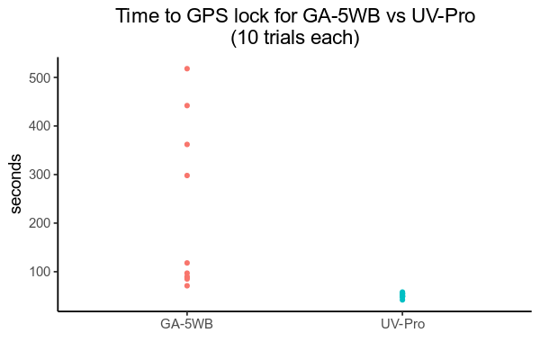

import { Image } from "astro:assets";
import ga5wb_unboxing from "./btech-uv-pro-vs-radiooddity-ga-5wb/PXL_20241127_221328508.jpg";
import uvpro_unboxing from "./btech-uv-pro-vs-radiooddity-ga-5wb/PXL_20241127_222408921.jpg";
import ga5wb_xmit from "./btech-uv-pro-vs-radiooddity-ga-5wb/uvpro_xmit_info.jpg";
import uvpro_xmit from "./btech-uv-pro-vs-radiooddity-ga-5wb/ga5wb_xmit_info.jpg";

Despite being sold by different companies under different model numbers, the BTech UV-Pro, RadioOddity GA-5WB, and Vero VR-N76 are essentially the same radio--just rebranded and slightly tweaked by their respective OEMs.

That said, even though they're built with the same hardware (BTech support confirmed they all have the same PCB), that doesn't mean they're _exactly_ the same. I first got the RadioOddity GA-5WB, then later the UV-Pro when it came out so I could compare them side-by-side. In my testing I found a number of differences between the radios, including the accessories they provide, their transmit power, firmware capabilities, and GPS performance.

**TL;DR: If you're looking at these radios and considering which one to get, get the UV-Pro.** The UV-Pro retails for less money (about $15 less), its firmware has support for NOAA alerts, and I found its GPS lock performance to be significantly better than the GA-5WB (So much so that I returned my GA-5WB and got another UV-Pro). I never had a chance to test a VR-N76, but on paper it looks similarly configured to the GA-5WB (but with similar transmit power as the UV-Pro).

This is not a sponsored review; I have no affiliation with BTech, RadioOddity, or Vero!

## What's in the box

  <figure class="flex flex-col items-center">
    <Image
      src={ga5wb_unboxing}
      alt="GA-5WB Unboxing"
      class="rounded shadow"
      width="360"
    />
    <figcaption class="mt-2 text-sm text-gray-600">
      Unboxing the GA-5WB
    </figcaption>
  </figure>
  <figure class="flex flex-col items-center">
    <Image
      src={uvpro_unboxing}
      alt="UV-Pro Unboxing"
      class="rounded shadow"
      width="360"
    />
    <figcaption class="mt-2 text-sm text-gray-600">
      Unboxing the UV-Pro
    </figcaption>
  </figure>

(Oops, should have taken the items out of the ziplog bags to make them clearer, sorry!)

| Included Item                                 | GA-5WB | UV-Pro |
| --------------------------------------------- | :----: | :----: |
| HT (handheld transceiver)                     |   ✅   |   ✅   |
| Battery                                       |   ✅   |   ✅   |
| Antenna                                       |   ✅   |   ✅   |
| USB-C charging cable                          |   ✅   |   ✅   |
| Belt clip                                     |   ✅   |   ✅   |
| K1 adapter cable                              |   ✅   |        |
| Colored rubber bands for identifying radios   |   ✅   |        |
| Multitool for attaching belt clip             |        |   ✅   |
| Lanyard attachment (alternative to belt clip) |        |   ✅   |

### Verdict

The biggest difference between what's included in the box is that the UV-Pro does not include a K1 adapter cable, and [sells it separately for $22](https://baofengtech.com/product/gmrs-pro-k1-adaptor).

That said, the GA-5WB retails for about $15 more than the UV-Pro! ($180 vs $165 at the time of this writing). Given that I have no need for the K1 adapter cable, the UV-Pro is the winner here.

## Transmit power

  <figure class="flex flex-col items-center">
    <Image
      src={uvpro_xmit}
      alt="GA-5WB transmit info on the inside of the battery slot"
      class="rounded shadow"
      width="360"
    />
    <figcaption class="mt-2 text-sm text-gray-600">
      Transmit Info for the GA-5WB
    </figcaption>
  </figure>
  <figure class="flex flex-col items-center">
    <Image
      src={ga5wb_xmit}
      alt="UV-Pro transmit info on the inside of the battery slot"
      class="rounded shadow"
      width="360"
    />
    <figcaption class="mt-2 text-sm text-gray-600">
      Transmit Info for the UV-Pro
    </figcaption>
  </figure>

(Images above show the device info sticker inside the battery slot; serial number boxed out). The GA-5WB lists its transmit power at 5W. The UV-Pro lists different numbers depending on where you look: the manual lists 7W, the website lists 5W, and the sticker on the inside of the battery slot lists 6W.

I emailed BTech to ask which was the real spec, and they replied that "the overall average will surpass 5W on the full bands while it can peak at up to 7W in the center of the amateur bands".

They also mentioned that they did their own tuning for FCC certification. The UV-Pro sticker lists an FCC id ([report here](https://fcc.report/FCC-ID/2AGND-UV-PRO)), but I was not able to find a similar filing for the GA-5WB. (That said, [other folks](https://www.youtube.com/watch?v=EREmgHFlBv4) have reported that the GA-5WB is within FCC spec on spurrious transmissions, unlike other cheap radios)

I ran my own transmit power test, using my [QRPLabs dummy load](https://qrp-labs.com/dummy.html). Here are the results:

| Freq      | Power Setting | GA-5WB (Peak V) | UV-Pro (Peak V) |
| --------- | ------------- | --------------- | --------------- |
| 146.0 MHz | L             | 8.6             | 8.3             |
| 146.0 MHz | M             | 12.0            | 11.3            |
| 146.0 MHz | H             | 14.8            | 17.8            |

Looking at the conversion graph for the dummy load, peak voltages on "High" correspond to roughly 5-6W as expected. Also, the UV-Pro transmits with a little more power on its maximum setting.

### Verdict

I actually prefer the lower transmit power of the GA-5WB, because the extra power for an HT doesn't translate into much more distance, and just drains the battery faster. That said, the difference is pretty small.

## Firmware / Software

The firmware on the GA-5WB and the UV-Pro are almost identical, with a few notable differences:

- The GA-5WB has 32 channel memory banks; the UV-Pro has 30 because 2 are sacrificed to store NOAA channels
- The UV-Pro has NOAA alerts, the GA-5WB does not
- The GA-5WB requires inputting an APRS passcode along with your callsign to enable beaconing, the UV-Pro does not impose this minor inconvenience

I believe the NOAA support was added for the UV-Pro because it is targeted more for the USA market.

Unfortunately, it is not possible to flash the GA-5WB firmware on the UV-Pro, and vice versa. (All flashing is done via the HT app, which auto-detects the device's model number). That said, I've been working on [reverse engineering the flashing protocol](https://github.com/khusmann/benlink/issues/10), and may have a way to do this in the future.

Both the GA-5WB and the UV-Pro use the [HT app](https://play.google.com/store/apps/details?id=com.benshikj.ht), although BTech also offers the [BTech UV Programmer](https://play.google.com/store/apps/details?id=com.benshikj.ht.btech.ham), which is exactly the same as the HT app, but with BTech branding.

### Verdict

The UV-Pro is a clear winner here (for USA audiences, at least), with NOAA alerts!

## GPS Performance

The final difference I observed between the radios was their performance getting a GPS lock. I was noticing that the GA-5WB seemed to be a lot less reliable getting GPS locks, so I finally sat down and did a side-by-side comparison.

I went into a park with a clear view of the sky, put the devices side by side, turned them on at exactly the same time and measured the amount of time it took to acquire GPS. I did this 10 times, turning on both radios at the same time and keeping them side-by-side.

I found a pretty big difference between the devices (see the graph below). The UV-Pro reliably acquired GPS with a median time of 50.5 seconds, whereas the GA-5WB had a median time of 107.5 seconds. But occasionally the GA-5WB took much longer... up to 518 seconds (8.6 minutes)!

There's was a few occasions in the field (not observed in this test) where it NEVER would get a lock, even after waiting over 20min, whereas the UV-Pro always seems to get one (as long as I have a clear view of the sky).

IMPORTANT NOTE: If you run this test yourself, do NOT allow your phone to connect to the radio. When the phone connects to the radio, your phone will send position updates to the radio that override the internal GPS. Very sneaky...!

### Verdict

I think it's possible my GA-5WB was defective (i.e. had an improperly soldered GPS module), so I returned it and got another UV-Pro instead. But I've since heard from other GA-5WB users that they've had similar experiences with GPS. If this is a more sysematic problem with the GA-5WB, this is a major strike against them!

## Final Thoughts

Although the GA-5WB and UV-Pro are almost identical, the inclusion of NOAA reports and superior GPS performance makes the UV-Pro a clear winner.

I did not have a VR-N76 to complete the comparison. I'd be especially interested to test its GPS lock performance. That said, even if its GPS was similar to the UV-Pro, I still think the UV-Pro comes out on top (for USA audiences, at least), because of its inclusion of NOAA reports in the firmware.

The UV-Pro also retails cheaper than the GA-5WB an VR-N76 (by about $15), and is available on Amazon with fast shipping from USA-based warehouses (whereas the GA-5WB and VR-N76 take longer to ship and are harder to return because they are shipped directly from China)
