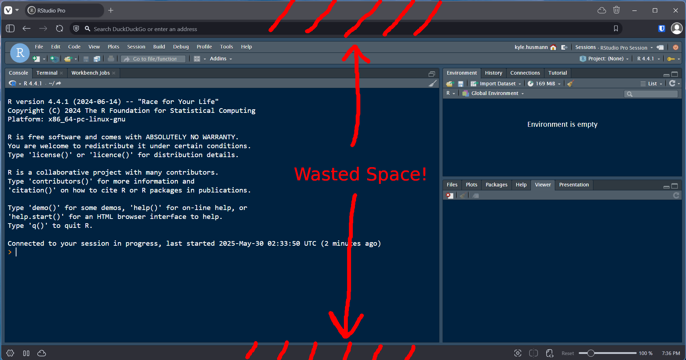
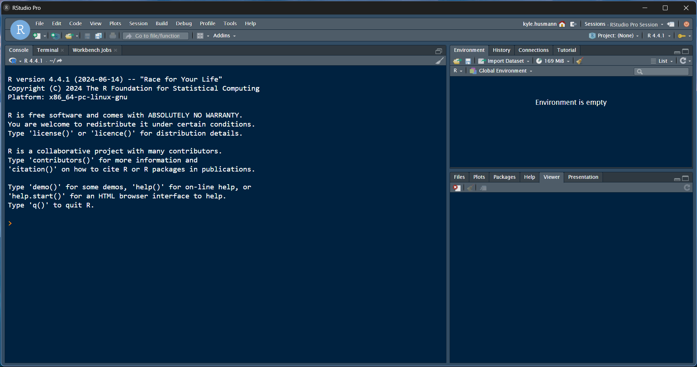
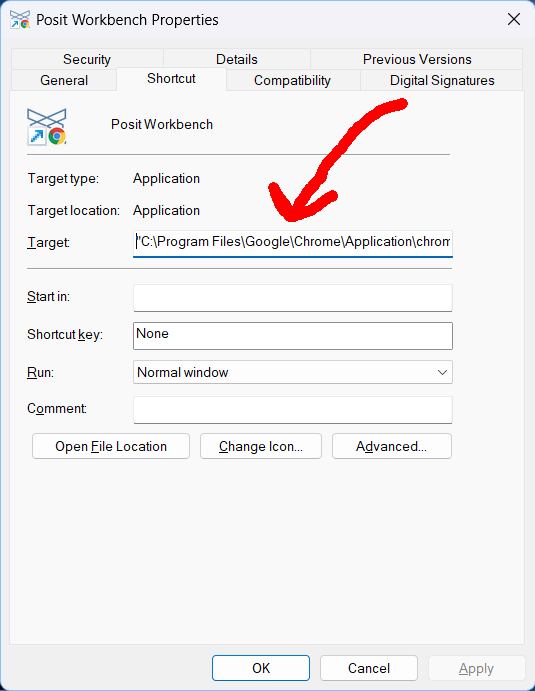

While I understand the need for centrally managed web-based IDEs, coding in a browser window has always felt so _wrong_ to me. When I code, I like to have the full screen at my disposal... this is why I'm a big fan of tiling window managers, like [I3](https://i3wm.org/) and [GlazeWM](https://github.com/glzr-io/glazewm).

An IDE session in a browser, by contrast, makes me feel cramped, and throws me off my groove. The tabs and address bar just sit there burning in a good inch off the top and bottom of my screen:

<figure class="flex flex-col items-center">



<figcaption class="mt-2 text-sm text-gray-600">
Look at all the space that is wasted!
</figcaption>
</figure>

Fortunately, it doesn't need to be this way, thanks to Chrome ["App Mode"](https://superuser.com/questions/33548/starting-google-chrome-in-application-mode). With "App Mode" you can create a shortcut that will launch Chrome without tabs, toolbars, etc., so that your web-IDE will run just like it was a normal app:

<figure class="flex flex-col items-center">



<figcaption class="mt-2 text-sm text-gray-600">
This looks like RStudio running natively, but it's actually Chrome in app-mode running Posit Workbench!
</figcaption>
</figure>

It's easy to set up! All you need to do is create a shortcut to your Posit Workbench instance, and then modify the shortcut to use Chrome App Mode:

1. Navigate to your Posit Workbench instance in Chrome
2. Click the 3 dots -> "Cast, save, and share" -> "Create shortcut..."
3. Create the shortcut
4. Right click on the shortcut you just created -> Properties
5. Edit the "Target" field to use the `--app=` parameter:

<figure class="flex flex-col items-center">

<div class="max-w-[450px]">



</div>
<figcaption class="mt-2 text-sm text-gray-600">
Set the "target" field in the shortcut properties window to the command below.
</figcaption>
</figure>

You'll want to add the `--app=` argument to your shortcut, like this:

```
"C:\Program Files\Google\Chrome\Application\chrome_proxy.exe" --app="https://<your-workbench-instance>"
```

...and then you're done!

A couple notes:

- The "Create shortcut..." button in Chrome creates a shortcut to `chrome_proxy.exe` is used instead of `chrome.exe` because [it allows it to embed the website favicon into the shortcut](https://superuser.com/questions/1680619/what-the-difference-between-chrome-and-chrome-proxy)

- The `--profile-directory=` argument will use or create a new Chrome profile to run your app in -- useful if you have different profiles for managing the credentials for different clients, etc.

- The `--user-data-dir=` argument will create a completely separate user data directory (with its own profiles!). This is useful if you want to _completely_ isolate your app session.

- The `--app=`, `--profile-directory=`, and `--user-data-dir=` args all work in Linux as well!

Enjoy!
