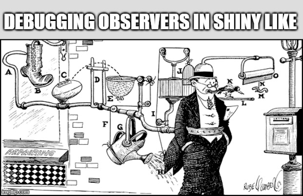

import ShinyPortal from "@/components/ShinyPortal";

export const base_url = "https://khusmann.github.io/shiny-dynamic-observers";
export const demo_url = x => `${base_url}/${x}/index.html`;
export const preview_url = x => `${base_url}/${x}/preview.png`;

[Dynamic UI](https://mastering-shiny.org/action-dynamic.html) in Shiny lets you update the interface in response to user input. But what happens when you want to dynamically _attach observers_ to those dynamic UI elements? Suddenly, things get tricky.

Let's look at a toy example to bring the challenge into focus. In this post we'll build a Shiny app that:

1. Lets the user choose a dataset
1. Lets them pick a subset of columns from the dataset
1. Creates a "card" for each selected column, which will (a) show the name of the column and (b) have a close button to remove it from the stack

Sounds straightforward, right? (Spoiler: it's not.) As we work through this, you'll see how subtle issues can arise... ones that can lead to confusing, hard-to-debug behavior. This post will walk through the build step by step, and show you where key pitfalls lie.

Here's what the final version of our app will look like:

<ShinyPortal
  url={demo_url("initial_demo")}
  preview={preview_url("initial_demo")}
  client:only="react"
/>

Let's get started!

## App Setup

Let's start with the easy part. In this section we'll set up an app that uses `uiOutput()`/`renderUI()` to dynamically render cards with close buttons that don't do anything (yet).

First, let's make a global variable called `all_datasets` that will hold all of the datasets available in the built-in datasets package:

```r
all_datasets <- ls("package:datasets") |>
  (\(v) v[order(tolower(v), v)])() |> # Case insensitive ordering
  set_names() |>
  map(\(x) get(x, "package:datasets")) |>
  keep(is.data.frame)
```

Next, here's a UI definition, with:

1. a title
2. a select input with the names of all the datasets
3. a selectize input we'll dynamically populate with the column names of the currently selected dataset, and
4. a `uiOutput` that will hold our cards.

```r
ui <- fluidPage(
  tags$head(tags$style(app_styles)),
  div(
    class = "centered-content",
    tags$h3("Dynamic Observer Demo"), # (1)
    selectInput( # (2)
      inputId = "dataset_select",
      label = "Select a dataset:",
      choices = names(all_datasets),
      width = "100%"
    ),
    selectizeInput( # (3)
      inputId = "column_select",
      label = "Select a column:",
      choices = c("Select a column to get started" = ""),
      multiple = TRUE,
      width = "100%",
      options = list(closeAfterSelect = TRUE)
    ),
    uiOutput("cards_ui", class = "card-container") # (4)
  )
)
```

And finally, a server definition, with:

1. A `reactive()` called `dataset`, that will always hold the currently selected dataset
2. An `observer()` that will always push the column names from our current dataset into the `column_select` `selectizeInput()`
3. A `renderUI()` that creates a card for each column that is selected. (Note how each close button gets a dynamic `inputId`!)

```r
server <- function(input, output, session) {
  dataset <- shiny::reactive({ # (1)
    all_datasets[[input$dataset_select]]
  })

  observe({ # (2)
    updateSelectizeInput(
      inputId = "column_select",
      choices = c("Select a column to get started" = "", names(dataset())),
    )
  })

  output$cards_ui <- renderUI({ # (3)
    map(rev(input$column_select), function(i) {
      if (is.numeric(dataset()[[i]])) {
        i_mean <- round(mean(dataset()[[i]], na.rm = TRUE), 2)
        extra <- glue("(mean: {i_mean})")
      } else {
        extra <- NULL
      }
      tags$div(
        class = "card",
        tags$div(tags$strong(i), extra),
        actionButton(
          inputId = glue("{i}_close"),
          label = icon("times"),
          class = "btn btn-xs btn-danger"
        )
      )
    })
  })
}
```

Here's the final result:

<ShinyPortal
  url={demo_url("setup")}
  preview={preview_url("setup")}
  client:only="react"
/>

Hooray, it works! Now, let's try to get those close buttons working...

## Close Buttons: Attempt 1

Ok, this is where things get interesting. I'd like to create an `observeEvent()` for each close button that will remove the appropriate column from my `column_select` input. In essance, I want to do this:

```r
walk(input$column_select, function(i) {
  close_btn_id <- glue("{i}_close")
  observeEvent(input[[close_btn_id]], {
      updateSelectInput(
        inputId = "column_select",
        selected = discard(input$column_select, \(j) j == i)
      )
    }
  )
})
```

But here's the problem... `input$column_select` is a reactive input, so it needs to go in a reactive context. That means I need to surround everything in another `observeEvent()`, triggered when `input$column_select` changes:

```r
observeEvent(input$column_select, {
  walk(input$column_select, function(i) {
    close_btn_id <- glue("{i}_close")
    observeEvent(input[[close_btn_id]], {
        updateSelectInput(
          inputId = "column_select",
          selected = discard(input$column_select, \(j) j == i)
        )
      }
    )
  })
})
```

That's right, we're looking at NESTED OBSERVERS! Does it work? Try the result below:

<ShinyPortal
  url={demo_url("attempt1")}
  preview={preview_url("attempt1")}
  client:only="react"
/>

Hooray it works! ...or does it?? Duh duh duhhhhh...

## Uh oh

As you might expect, there's a fatal bug in the above implementation. Here are the steps to reproduce:

1. Add a card via the `column_select` input.
2. Remove the card by clicking the "remove" button on the card.
3. Add the same card again.
4. Uh oh.

You will notice that when you try to re-add a card, it immediately disappears. Why, you ask? Turns out, it's a weird interaction of quirks between `actionButton()`s and the default behavior of `observeEvent()`:

1. When the card's `actionButton()` first spawns, the value of `input${i}_close` will be `0`. (Where `{i}` is the name of the column).
2. Because `ignoreNULL = TRUE` by default for `observeEvent()`, the `observeEvent()` is not triggered. (`ignoreNULL = TRUE` also applies to `0` in the special case of `actionButton()`... [docs link](https://shiny.posit.co/r/reference/shiny/1.6.0/bindevent.html#ignorenull-and-ignoreinit))
3. When you click the remove button, the value for `input${i}_close` becomes `1`, and the `observeEvent()` is triggered, removing the card.
4. When you try to re-add the button, the button is respawned... with `input${i}_close` still set to `1`! Because this is non-null, the `observeEvent()` is triggered when it gets respawned as well.
5. ...which removes your card as soon as you try to add it.

Current mood:



## Close Buttons: Attempt 2

Ok, now that we know the issue, let's try to fix it! Let's add `ignoreInit = TRUE` so when the observer wakes up a second time, it won't be re-triggered:

```r
observeEvent(input$column_select, {
  walk(input$column_select, function(i) {
    close_btn_id <- glue("{i}_close")
    observeEvent(input[[close_btn_id]], {
        updateSelectInput(
          inputId = "column_select",
          selected = discard(input$column_select, \(j) j == i)
        )
      },
      ignoreInit = TRUE # New!
    )
  })
})
```

Resulting app:

<ShinyPortal
  url={demo_url("attempt2")}
  preview={preview_url("attempt2")}
  client:only="react"
/>

Hooray it finally works!

## No, it doesn't

There's a hidden, insidious bug in the above implementation. A memory leak, in fact. To see it, let's keep track of every time the `observeEvent()` is run:

```r
observeEvent(input$column_select, {
  walk(input$column_select, function(i) {
    close_btn_id <- glue("{i}_close")
    observeEvent(input[[close_btn_id]], {
        appendMessage(glue("Closing {i}")) # New!
        updateSelectInput(
          inputId = "column_select",
          selected = discard(input$column_select, \(j) j == i)
        )
      },
      ignoreInit = TRUE
    )
  })
})
```

Here, `appendMessage()` will simply add a line of text to a log container I added to the app (check out the <a href={`${demo_url("attempt2_dbg")}?_shinylive-mode=editor-terminal-viewer`} target="\_blank">source</a>) if you're interested in the implementation). Now, we can keep track of every time the `observeEvent()` is run:

<ShinyPortal
  url={demo_url("attempt2_dbg")}
  preview={preview_url("attempt2_dbg")}
  client:only="react"
/>

Here's how to observe the bug:

1. Add a column using the `column_select` input.
1. Remove the column by clicking the remove button.
1. Add the same column again.
1. Remove the column by clicking the remove button.

You'll notice that the second time you remove the column, the `observeEvent()` is run twice! If you add and remove the column again, it'll run three times! Every time you add and remove the column, a new run is added to the conga line.

Now, in this toy application we didn't notice this was happening behind the scenes because the action we're triggering can be repeated. Imagine we were doing something else, like toggling the visibility of something... in that case, you'd get a weird bug that would only manifest every odd or even number of runs... yikes!

So why is this happening? Well, as you have probably guessed, it's because the inner `observeEvent()`s in our nested observer are preserved across runs of the outer observer. So every time the outer observer runs, a new inner observer is created and... well, it hangs around and continues to run.

## Close Buttons: Attempt 3

Ok, how about we make the observer self-destruct as soon as it is triggered by adding `once = TRUE`:

```r
observeEvent(input$column_select, {
  walk(input$column_select, function(i) {
    close_btn_id <- glue("{i}_close")
    observeEvent(input[[close_btn_id]], {
        appendMessage(glue("Closing {i}")) # New!
        updateSelectInput(
          inputId = "column_select",
          selected = discard(input$column_select, \(j) j == i)
        )
      },
      ignoreInit = TRUE,
      once = TRUE
    )
  })
})
```

Does this solve our problem? See for yourself:

<ShinyPortal
  url={demo_url("attempt3")}
  preview={preview_url("attempt3")}
  client:only="react"
/>

As you can see, this _sort of_ helps. If you add and remove a single column multiple times, it appears to work. But try the following:

1. Add a column.
1. Add another column.
1. Remove one of the columns.

...and you'll see two removal messages, instead of one. Here's another one:

1. Add a column.
1. Remove the column by way of the `column_select` input (not the close button!)
1. Re-add the column.
1. Remove the column by way of the close button.

## The Solution

To properly fix this, we need to manually manage the lifecycle of our dynamic observers. As it turns out, when you call `observer()` or `observeEvent()`, it returns an R6 object for that observer. If you keep this object around, you can call `$destroy()` on it to disarm it and relaim its resources.

```r
obs <- observer({
  ...
})

# Sometime later...
obs$destroy()
```

So! We'll create a `reactiveVal()` that will hold a list of all the close button observers we've created, and we'll destroy all of them via `val$destroy()` before creating new ones every time the parent `input$column_select` observer is triggered:

```r
  dynamic_observers <- reactiveVal(list())

  observeEvent(input$column_select, {
    walk(dynamic_observers(), \(i) i$destroy())

    new_observers <- map(input$column_select, function(i) {
      close_btn_id <- paste0(i, "_close")
      observeEvent(input[[close_btn_id]], {
          appendMessage(glue("Closing {i}"))
          updateSelectInput(
            inputId = "column_select",
            selected = discard(input$column_select, \(j) j == i)
          )
        },
        ignoreInit = TRUE
      )
    })

    dynamic_observers(new_observers)
  })
```

Here's the result:

<ShinyPortal
  url={demo_url("solution")}
  preview={preview_url("solution")}
  client:only="react"
/>
